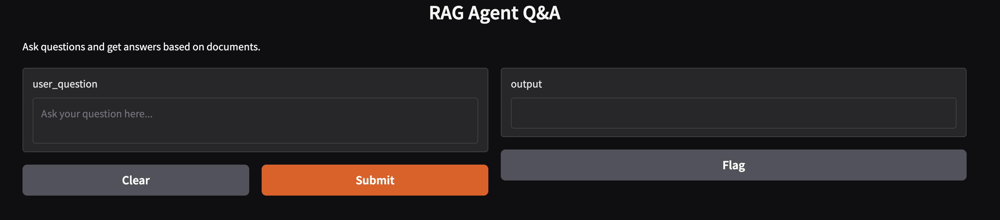

# RAG System Documentation

## Installation

Welcome to the RAG System! This documentation will guide you through the general usage of the system, including how to run the application, where to find the tests, and how to contribute.

### Getting Started

To get started, clone the repository and install the dependencies:

```bash
git clone https://github.com/Apurro12/QA_gradio.git
cd rag_system
uv sync
```

fill the ```.env``` file using ```.env.example```

## Quickstart

You can start the application using:

```bash
uv run main.py
```

or 
```bash
uv run main.py --offline
```

You will se a webpage where you can ask questions about your available documents




### Where Are the Tests?


```bash
uv run pytest
```


---

## Chapter 2: Logging

Logging is an essential part of the RAG System, providing insight into system behavior and aiding in debugging.

### How Logging Works

The system uses a centralized logging module located in `src/logging/`. This module handles all log messages, including errors, warnings, and informational messages.

### Log Levels

The following log levels are supported:

- **info**: General information about system operations.
- **warn**: Warnings about potential issues.
- **error**: Errors that require attention.
- **debug**: Detailed debugging information (enabled in development mode).

### Configuring Logging

You can configure logging behavior in the `config/logging.js` file. This includes log level, output format, and log file location.

### Viewing Logs

Logs are output to the console by default. If file logging is enabled, logs can be found in the `logs/` directory.

---

## Chapter 3: Agent Internals

This chapter details the internal workflow of the agent, including how questions are processed, classified, and answered.

### Overview

The agent is responsible for orchestrating the process of answering user questions using a Retrieval-Augmented Generation (RAG) approach. The workflow consists of the following main steps:

1. **Receiving the User Question**: The agent receives a question from the user interface.
2. **Classification**: The agent uses a classifier to determine which document (if any) is most relevant to the question.
3. **Context Extraction**: The relevant document's content is extracted to serve as context for answer generation.
4. **Answer Generation**: The agent uses an answer generator (typically backed by an LLM) to produce a response based on the question and the extracted context.
5. **Fallback Handling**: If no relevant document is found, the agent returns a default message indicating no information is available.

### Step-by-Step Workflow

#### 1. Receiving the User Question

The agent exposes a method `respond_user_question(question: str) -> str` which is called with the user's question.

#### 2. Classification

- The agent uses a `BaseQuestionClassifier` implementation (e.g., `ExactMatchClassifier`) to classify the question.
- The classifier attempts to match the question to a document in the knowledge base.
- If a match is found, the corresponding document is returned.
- If no match is found, an empty or default document is returned.

#### 3. Context Extraction

- The agent extracts the `content` field from the classified document.
- This content serves as the context for answer generation.

#### 4. Answer Generation

- The agent uses a `BaseAnswerGenerator` implementation (e.g., `AnswerGenerator` or `OfflineAnswerGenerator`).
- The answer generator takes the question and the extracted context and generates a response.
    - In online mode, this typically involves invoking an LLM with a prompt containing the context and question.
    - In offline mode, a mock or deterministic response is generated for testing purposes.

#### 5. Fallback Handling

- If the classifier returns no relevant document (i.e., context is empty), the agent returns a default message:  
  `"No relevant information found to answer your question."`

### Example Flow

1. User asks: "How can I get a refund?"
2. The agent calls the classifier, which finds a document about refunds.
3. The agent extracts the refund policy text as context.
4. The answer generator uses the question and context to generate a response.
5. The response is returned to the user.

If the user asks an unrelated question, the agent will respond with the fallback message.

### Key Components

- **Agent**: Orchestrates the workflow.
- **Question Classifier**: Matches questions to documents.
- **Answer Generator**: Produces answers using context and question.
- **Document Loader**: Supplies documents to the classifier (offline/online).
- **LLM Client**: Used by the answer generator for language model inference.

### Extensibility

- The agent can be extended with more advanced classifiers (e.g., fuzzy matching, semantic search).
- The answer generator can be swapped for different LLMs or answer strategies.
- Additional logic can be added for multi-document retrieval, ranking, or answer post-processing.

---

Continue to the next chapters for more advanced topics and system internals.
