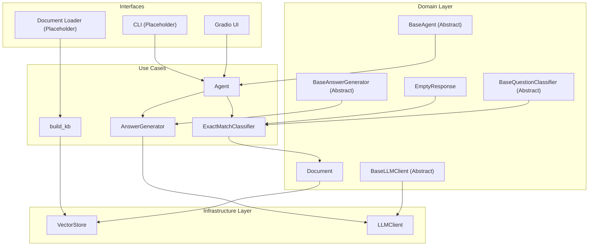

# System Architecture
## Need to be refined later

```mermaid
graph TD
    subgraph Domain Layer
        BaseAgent["BaseAgent (Abstract)"]
        BaseLLMClient["BaseLLMClient (Abstract)"]
        BaseQuestionClassifier["BaseQuestionClassifier (Abstract)"]
        BaseAnswerGenerator["BaseAnswerGenerator (Abstract)"]
        Document["Document"]
        EmptyResponse["EmptyResponse"]
    end

    subgraph Use Cases
        Agent["Agent"]
        ExactMatchClassifier["ExactMatchClassifier"]
        AnswerGenerator["AnswerGenerator"]
        BuildKB["build_kb"]
    end

    subgraph Infrastructure Layer
        VectorStore["VectorStore"]
        LLMClient["LLMClient"]
    end

    subgraph Interfaces
        GradioUI["Gradio UI"]
        CLI["CLI (Placeholder)"]
        DocumentLoader["Document Loader (Placeholder)"]
    end

    BaseAgent --> Agent
    BaseLLMClient --> LLMClient
    BaseQuestionClassifier --> ExactMatchClassifier
    BaseAnswerGenerator --> AnswerGenerator
    Document --> VectorStore
    EmptyResponse --> ExactMatchClassifier

    Agent --> ExactMatchClassifier
    Agent --> AnswerGenerator
    ExactMatchClassifier --> Document
    AnswerGenerator --> LLMClient
    BuildKB --> VectorStore

    GradioUI --> Agent
    CLI --> Agent
    DocumentLoader --> BuildKB
```
